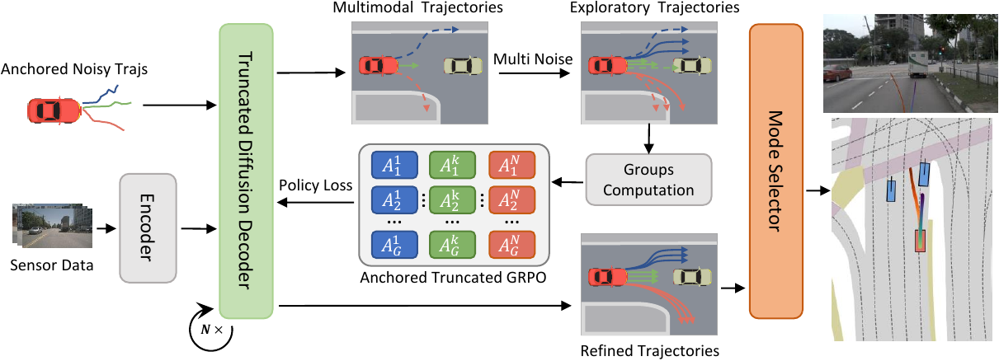
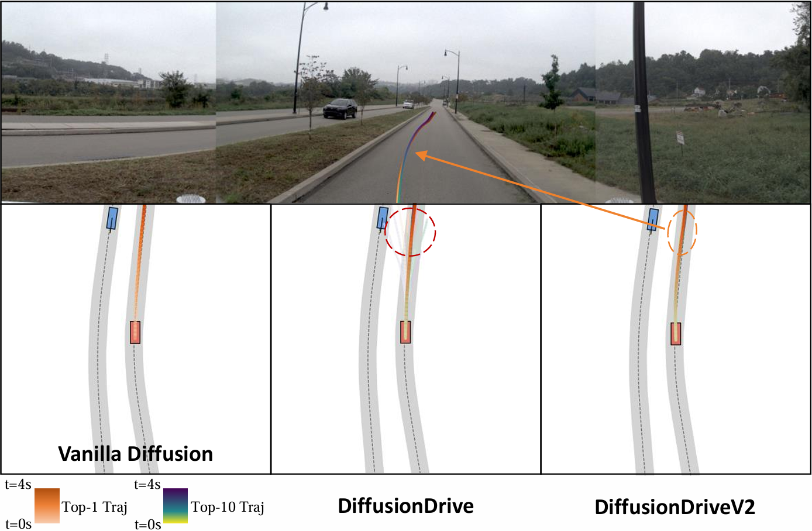
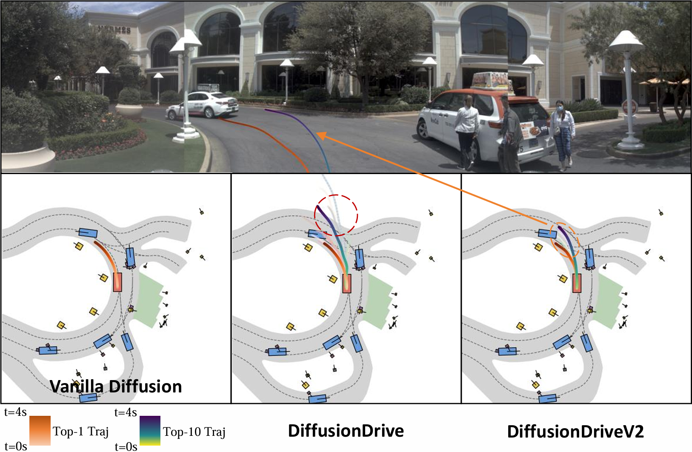
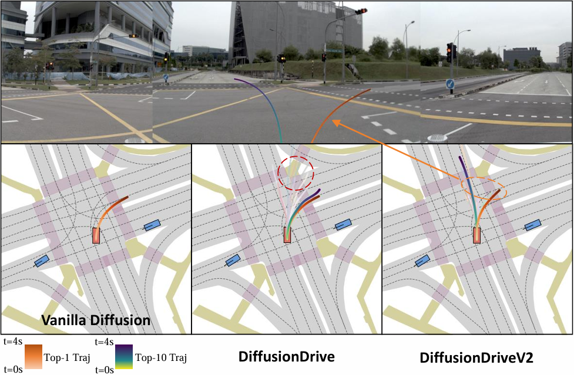

<div align="center">
<h1>DiffusionDriveV2</h1>
<h3>Reinforcement Learning-Constrained Truncated Diffusion Modeling in End-to-End Autonomous Driving</h3>

[Jialv Zou](https://github.com/Doctor-James)<sup>1</sup>, [Shaoyu Chen](https://scholar.google.com/citations?user=PIeNN2gAAAAJ&hl=en&oi=sra)<sup>3,†</sup>, [Bencheng Liao](https://github.com/LegendBC)<sup>2,1</sup>, Zhiyu Zheng<sup>4</sup>, Yuehao Song<sup>1</sup>, \
[Lefei Zhang](https://scholar.google.com/citations?user=BLKHwNwAAAAJ&hl=zh-CN&oi=ao)<sup>4</sup>, [Qian Zhang](https://scholar.google.com/citations?user=pCY-bikAAAAJ&hl=zh-CN)<sup>3</sup>, [Wenyu Liu](http://eic.hust.edu.cn/professor/liuwenyu/)<sup>1</sup>, [Xinggang Wang](https://xwcv.github.io/)<sup>1,📧</sup>

<sup>1</sup> School of EIC, Huazhong University of Science and Technology \
<sup>2</sup> Institute of Artificial Intelligence, Huazhong University of Science and Technology \
<sup>3</sup> Horizon Robotics \
<sup>4</sup> School of Computer Science, Wuhan University

<sup>📧</sup> corresponding author | †Project Lead

[](https://opensource.org/licenses/Apache-2.0)


</div>

## News
* **` Dec. 9th, 2025`:** We released our paper on [Arxiv](https://arxiv.org/abs/2512.07745), and released the initial version of code and weights, along with documentation and training/evaluation scripts.

## Table of Contents
- [Introduction](#introduction)
- [Qualitative Results on NAVSIM](#qualitative-results-on-navsim)
- [Getting Started](#getting-started)
- [Contact](#contact)
- [Acknowledgement](#acknowledgement)
- [Citation](#citation)

## Introduction
Generative diffusion models for end-to-end autonomous driving often suffer from mode collapse, tending to generate conservative and homogeneous behaviors. While DiffusionDrive employs predefined anchors representing different driving intentions to partition the action space and generate diverse trajectories, its reliance on imitation learning lacks sufficient constraints, resulting in a dilemma between diversity and consistent high quality. In this work, we propose DiffusionDriveV2, which leverages reinforcement learning to both constrain low-quality modes and explore for superior trajectories. This significantly enhances the overall output quality while preserving the inherent multimodality of its core Gaussian Mixture Model. First, we use scale-adaptive multiplicative noise, ideal for trajectory planning, to promote broad exploration. Second, we employ intra-anchor GRPO to manage advantage estimation among samples generated from a single anchor, and inter-anchor truncated GRPO to incorporate a global perspective across different anchors, preventing improper advantage comparisons between distinct intentions (e.g., turning vs. going straight), which can lead to further mode collapse. DiffusionDriveV2 achieves 91.2 PDMS on the NAVSIM v1 dataset and 85.5 EPDMS on the NAVSIM v2 dataset in closed-loop evaluation with an aligned ResNet-34 backbone, setting a new record. Further experiments validate that our approach resolves the dilemma between diversity and consistent high quality for truncated diffusion models, achieving the best trade-off.

<div align="center">
<b>Overall architecture of DiffusionDriveV2. </b>

</div>

## Qualitative Results on NAVSIM
<div align="center">
  <b>Going straight behavior.</b>
  
  <b>Turning left with diverse lane-changing behavior.</b>
  
  <b>Complex driving scenarios with multiple potential solutions.</b>
  
</div>


## Getting Started

- [Getting started from NAVSIM environment preparation](https://github.com/autonomousvision/navsim?tab=readme-ov-file#getting-started-)
- [Preparation of DiffusionDriveV2 environment](docs/install.md)
- [Training and Evaluation](docs/train_eval.md)


## Contact
If you have any questions, please contact [Jialv Zou](https://github.com/Doctor-James) via email (jialvzou@hust.edu.cn).

## Acknowledgement
DiffusionDrive is greatly inspired by the following outstanding contributions to the open-source community: [NAVSIM](https://github.com/autonomousvision/navsim), [DiffusionDrive](https://github.com/hustvl/DiffusionDrive), [DPPO](https://github.com/irom-princeton/dppo), [DeepSeek-R1
](https://github.com/deepseek-ai/DeepSeek-R1).

## Citation
If you find DiffusionDriveV2 is useful in your research or applications, please consider giving us a star 🌟 and citing it by the following BibTeX entry.

```bibtex
@misc{zou2025diffusiondrivev2reinforcementlearningconstrainedtruncated,
      title={DiffusionDriveV2: Reinforcement Learning-Constrained Truncated Diffusion Modeling in End-to-End Autonomous Driving}, 
      author={Jialv Zou and Shaoyu Chen and Bencheng Liao and Zhiyu Zheng and Yuehao Song and Lefei Zhang and Qian Zhang and Wenyu Liu and Xinggang Wang},
      year={2025},
      eprint={2512.07745},
      archivePrefix={arXiv},
      primaryClass={cs.CV},
      url={https://arxiv.org/abs/2512.07745}, 
}
```
